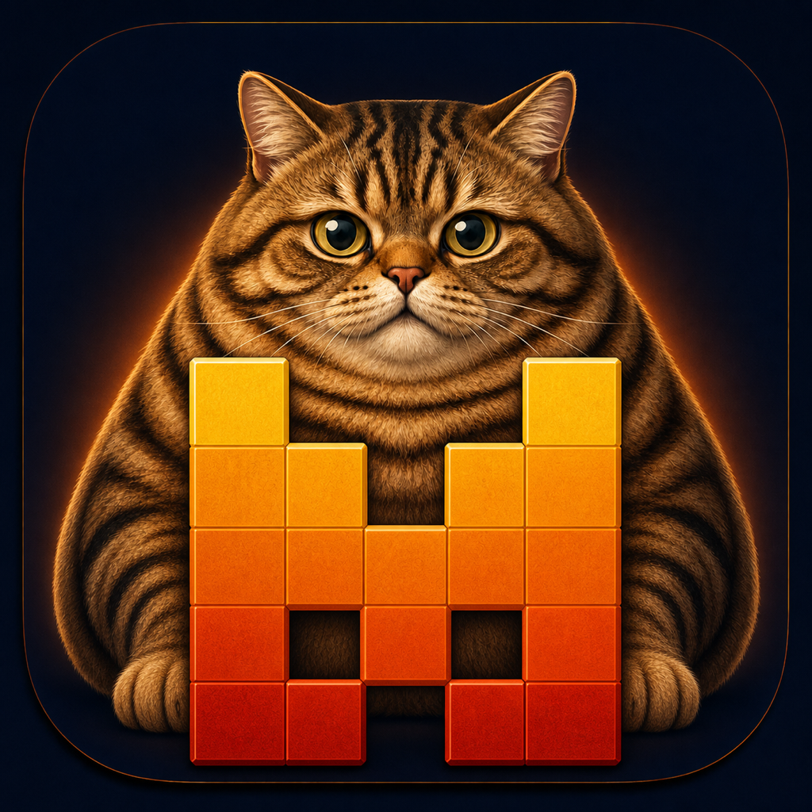
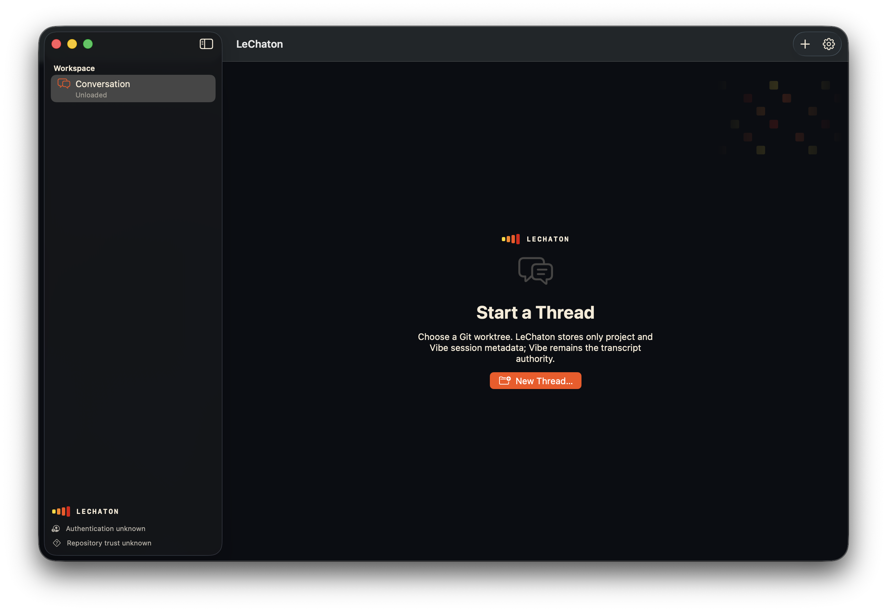

<p align="center">
  
</p>

<h1 align="center">LeChaton</h1>

LeChaton is a native macOS client for [Mistral Vibe](https://docs.mistral.ai/vibe/overview), built around the Agent Client Protocol (ACP). The hackathon prototype focuses on safely restoring one local coding thread across app and Vibe process restarts without copying conversation content into its own database.

> [!IMPORTANT]
> LeChaton is under active hackathon development. You can build it from source today, but a signed and notarized download is not available yet.

[View GitHub releases](../../releases)



## Prototype scope

The current prototype is designed to provide:

- A native SwiftUI workspace for one saved local-repository thread.
- Explicit thread resume with replay-safe message, reasoning, and tool restoration.
- Streaming prompts, tool activity, dynamic permissions, and cancellation.
- Vibe-managed browser authentication and repository trust decisions.
- Model and thinking controls with fresh-process verification and recovery.
- Bounded, read-only inspection of staged, unstaged, and untracked Git changes.
- Metadata-only local persistence: Vibe remains the transcript authority.

The compatibility gate for the supported Vibe release has passed. Its sanitized, content-free evidence is available in the [Vibe 2.21.0 compatibility report](docs/compatibility/vibe-2.21.0-live-gate.md).

## Requirements

- An Apple Silicon Mac.
- macOS 26.0 or later.
- Xcode 26 with the macOS 26 SDK.
- [Mise](https://mise.jdx.dev/getting-started.html).
- Mistral Vibe **2.21.0**, including the `vibe-acp` executable.
- A non-bare local Git worktree with a valid `HEAD` commit.

LeChaton intentionally validates the exact Vibe version instead of assuming compatibility with other releases. Install Vibe using the [official Mistral instructions](https://docs.mistral.ai/getting-started/quickstarts/vibe-code/install-cli), then confirm the installed version:

```sh
vibe --version
```

If a different release is installed through `uv`, install the supported version explicitly:

```sh
uv tool install --force "mistral-vibe==2.21.0"
```

## Build and run

After cloning this repository, run:

```sh
mise install
mise exec -- tuist install --no-update
script/build_and_run.sh
```

Mise installs the pinned Tuist 4.59.2 toolchain. Tuist resolves the dependency versions committed to the repository and generates the Xcode workspace locally; generated projects and workspaces are intentionally not committed.

The canonical run script also provides development modes:

```sh
script/build_and_run.sh --verify
script/build_and_run.sh --debug
script/build_and_run.sh --logs
script/build_and_run.sh --telemetry
```

## First run

1. Make sure Vibe 2.21.0 is installed and available as `vibe-acp`.
2. Launch LeChaton and select a local Git repository when creating a thread.
3. Complete Vibe's browser sign-in if requested.
4. Review the repository-trust choices supplied by Vibe.
5. Review every tool permission before allowing it.

LeChaton looks for `vibe-acp` in the saved user-selected location and common installation locations. If it cannot find a compatible executable, it presents the native file picker.

Authentication credentials, repository trust decisions, and conversation content remain owned by Vibe. LeChaton stores only the project and thread identifiers, the local environment, the selected executable path, and the selected-thread metadata needed for restoration.

> [!WARNING]
> A Vibe session can inspect and modify the repository or run commands when you grant the corresponding permission. Use a repository you are comfortable testing with and read permission prompts carefully.

## Tests

Bootstrap dependencies once, then run the deterministic offline suite:

```sh
mise exec -- tuist test
```

The live ACP probe is deliberately separate and opt-in because it uses a real Vibe account, creates sessions, temporarily exercises Vibe configuration, and runs tools inside a disposable Git worktree. See the [hackathon plan](docs/hackathon-plan.md) and [compatibility report](docs/compatibility/vibe-2.21.0-live-gate.md) before running it.

## Architecture

LeChaton keeps the native app, reusable runtime, live compatibility probe, and deterministic test process behind explicit target boundaries:

| Target | Responsibility |
| --- | --- |
| `LeChaton` | SwiftUI application, native system pickers, and workspace presentation |
| `LeChatonCore` | ACP transport, Vibe integration, session state, persistence, process cleanup, and Git inspection |
| `ACPProbe` | Explicit live compatibility and recovery validation against Vibe |
| `FakeACPAgent` | Deterministic process-boundary behavior for offline tests |
| `LeChatonTests` | Core and integration-boundary test coverage |

Dependencies point toward `LeChatonCore`; the core does not import the app or test targets. Architecture decisions and their status are indexed in [the documentation guide](docs/README.md).

## Known limitations

- The prototype supports macOS 26 and Apple Silicon only.
- Exactly one user-accessible saved thread is supported.
- Vibe 2.21.0 is the only validated agent release.
- Only local, non-bare Git worktrees with a valid `HEAD` are accepted.
- Repository relocation, import, multiple projects, attachments, and thread management are deferred.
- Plans are live transient state and are not restored with conversation history.
- Model and thinking values are Vibe-wide settings in the supported release, not truly thread-local preferences.
- App Sandbox, App Store distribution, automatic updates, and a signed downloadable build are outside the current hackathon scope.

## Project documentation

- [Hackathon implementation plan](docs/hackathon-plan.md)
- [Product specification](docs/product-spec.md)
- [Technical specification](docs/technical-spec.md)
- [Architecture decision records](docs/README.md#architecture-decisions)
- [Known Vibe ACP constraints](docs/vibe-acp-issues.md)
