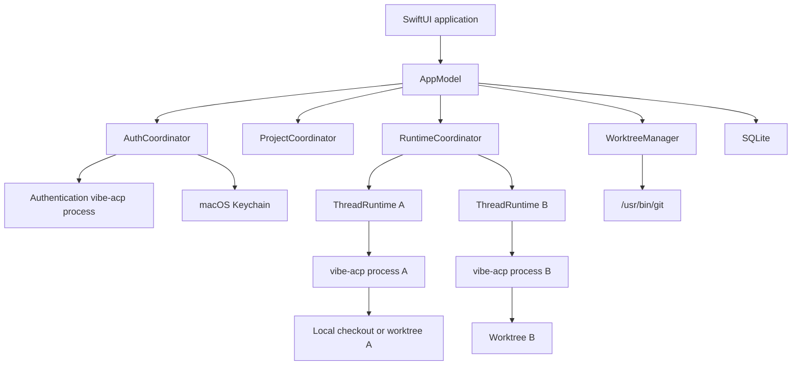

# VibeApp Technical Specification

**Status:** Draft v0.2
**Date:** 2026-07-18
**Platform:** macOS 26.0 or later
**Architecture:** Apple Silicon only
**Reference Vibe version:** 2.21.0

Product behavior and requirements live in the [Product Specification](./product-spec.md).
Upstream constraints and validation risks are tracked in [Vibe ACP Issues](./vibe-acp-issues.md).

## 1. Technical summary

VibeApp is a native SwiftUI client for Mistral Vibe's Agent Client Protocol implementation.

Key decisions:

- Communicate with `vibe-acp` over newline-delimited JSON-RPC on stdio.
- Run one `vibe-acp` process per active thread.
- Run no process for an idle thread; restore it with `session/load`.
- Let Vibe execute filesystem and shell tools in the MVP.
- Use a dedicated authentication process for browser sign-in.
- Use Git worktrees to isolate same-project parallel threads.
- Treat Vibe's session log as transcript authority and store only app metadata locally.

```text
One project -> many threads
One active thread -> one vibe-acp process and one cwd
One idle thread -> persisted metadata only
```

## 2. Platform and dependencies

| Component | Decision |
|---|---|
| Deployment target | macOS 26.0 |
| CPU | Apple Silicon `arm64` only |
| Swift | Swift 6.3 |
| Reference Xcode | Xcode 26.5 |
| UI | SwiftUI with AppKit interop |
| Persistence | SQLite through GRDB |
| Credentials | macOS Keychain and Vibe-managed browser auth |
| Distribution | Developer ID, hardened runtime, notarization |

No Intel build, universal binary, Rosetta validation, or backward-compatibility UI layer is required.

## 3. System architecture



## 4. Modules

### 4.1 `VibeAppUI`

SwiftUI views, navigation, onboarding, menus, settings, inspectors, approval sheets, and window management.

### 4.2 `AppModel`

Top-level application state and coordination.

### 4.3 `AuthCoordinator`

Owns authentication status, delegated browser attempts, Keychain credentials, sign out, and authentication environments for thread processes.

### 4.4 `ProjectStore`

Owns project metadata, recent-project ordering, repository identity, and editor preferences.

### 4.5 `ThreadStore`

Owns app-level thread metadata and execution-environment associations. Vibe remains transcript authority.

### 4.6 `RuntimeCoordinator`

An actor responsible for:

- Runtimes keyed by thread ID.
- The global concurrency limit.
- Queued turns.
- Process launch and termination.
- Idle timeout.
- Crash isolation.
- Cancellation.

### 4.7 `ThreadRuntime`

Owns one active thread runtime:

```text
ThreadRuntime
|- VibeProcess
|- ACPConnection
|- SessionController
`- SessionReducer
```

### 4.8 `ACPProtocol`

Swift `Codable` types for the supported ACP v1 subset.

The decoder must:

- Ignore unknown object fields.
- Preserve `_meta` fields.
- Support unknown enum values.
- Keep protocol objects separate from UI models.
- Capability-gate optional methods.

### 4.9 `ACPTransport`

Owns process stdin/stdout, newline framing, stderr diagnostics, partial-read buffering, request IDs, response correlation, incoming request routing, and termination detection.

### 4.10 `VibeAdapter`

Owns executable discovery, version reporting, authentication extensions, workspace trust, Vibe-specific `_meta`, config options, and compatibility diagnostics.

Standard ACP code must not depend directly on Vibe extensions.

### 4.11 `SessionController`

Owns `session/new`, `session/load`, `session/prompt`, `session/cancel`, `session/close`, permission responses, and turn state.

### 4.12 `SessionReducer`

Transforms incremental session events into normalized UI state. Updates are merged by stable IDs such as `messageId` and `toolCallId`.

### 4.13 `WorktreeManager`

Creates, validates, opens, and safely removes managed Git worktrees.

### 4.14 `GitService`

Runs `/usr/bin/git` with explicit argument arrays and an explicit working directory. It must not construct shell strings from user-controlled paths.

## 5. Persistence

Use SQLite through GRDB with migrations from the first release.

Proposed tables:

```text
projects
threads
thread_environments
worktrees
app_settings
auth_metadata
diagnostic_events
```

Store:

- Project identity and path.
- Vibe session ID.
- Thread title and archive state.
- Local or Worktree execution mode.
- Worktree path and starting ref.
- Effective thread mode.
- Non-secret authentication source metadata.
- UI state and unread status.

Do not store:

- Browser-authenticated credentials.
- Manual API-key contents.
- A duplicate transcript as the primary source of truth.

## 6. ACP transport

`vibe-acp` is launched as a child process:

```text
VibeApp -> stdin  -> vibe-acp
VibeApp <- stdout <- vibe-acp protocol messages
VibeApp <- stderr <- diagnostics
```

Each stdout line is one UTF-8 JSON-RPC message. The router handles:

- Requests containing `id` and `method`.
- Notifications containing `method` without `id`.
- Responses containing `id` and `result` or `error`.

The permanent read loop must remain active while an outgoing request is pending. In particular, `session/request_permission` can arrive before `session/prompt` completes.

`ACPConnection` should be a Swift actor with:

```swift
actor ACPConnection {
    private var nextRequestID: Int
    private var pendingResponses: [Int: PendingRequest]
    private var requestHandlers: [String: RequestHandler]
    private var notificationHandlers: [String: NotificationHandler]
}
```

Unknown notifications should be logged at debug level and ignored unless they indicate a negotiated feature.

## 7. ACP lifecycle

### 7.1 Initialize

Send `initialize` once per process with:

- ACP protocol version.
- `VibeApp` client name and version.
- Supported capabilities.
- Vibe authentication extension metadata when using the auth process.

Do not infer optional features from the Vibe version. Use the returned capabilities.

### 7.2 New thread

```text
Create execution environment
-> launch vibe-acp with explicit cwd and authentication
-> initialize
-> session/new(cwd)
-> persist sessionId
-> session/prompt
```

### 7.3 Existing thread

```text
Launch vibe-acp with stored cwd and authentication
-> initialize
-> prepare empty reducer state
-> session/load(sessionId, cwd)
-> reduce replayed session/update notifications
-> session/prompt
```

The reducer must exist before `session/load` because replay events arrive before the load response completes.

### 7.4 Prompt and cancellation

Only one prompt may be active per Vibe session.

A prompt remains pending while message chunks, plans, tools, and permission requests stream. Cancellation sends `session/cancel`, resolves pending permissions as cancelled, accepts late updates, and waits for the prompt response to finish with a cancelled stop reason.

### 7.5 Turn completion and idle timeout

- Keep the thread process warm for ten minutes.
- Reuse it for immediate follow-ups.
- On timeout, call `session/close` and terminate the process.
- Retain the session ID and environment association.

## 8. Authentication

### 8.1 Authentication process

Authentication uses a dedicated `vibe-acp` process launched in a neutral application-support directory. It is not tied to any project.

On startup:

1. Locate `vibe-acp`.
2. Launch the auth process.
3. Initialize with delegated browser support:

```json
{
  "clientCapabilities": {
    "_meta": {
      "browser-auth-delegated": true
    }
  }
}
```

4. Call Vibe's `auth/status` extension.
5. Gate thread runtimes on authenticated state.

### 8.2 Browser authentication

```text
authenticate(methodId: browser-auth-delegated, action: start)
<- signInUrl, attemptId, expiresAt
open signInUrl with NSWorkspace
authenticate(methodId: browser-auth-delegated,
             action: complete,
             attemptId: ...)
<- completed
auth/status
```

The same auth process must perform `start` and `complete` because Vibe stores the pending attempt in process memory.

Do not use an embedded `WKWebView` for provider authentication.

### 8.3 Manual API key

- Collect the key with `SecureField`.
- Store it in an app-specific Keychain item.
- Inject it only into `vibe-acp` using the provider environment variable, normally `MISTRAL_API_KEY`.
- Never propagate it to Git or unrelated subprocesses.
- Never log the child environment.

### 8.4 Sign out

1. Wait for or cancel active turns.
2. Terminate warm runtimes.
3. Call `auth/signOut` for Vibe-managed browser credentials.
4. Delete any app-managed Keychain credential.
5. Restart the auth process and verify unauthenticated state.

## 9. Process and concurrency model

### 9.1 One process per active thread

Vibe 2.21.0 calls `os.chdir(cwd)` during session creation, loading, and forking. Its core Bash and filesystem tools resolve relative paths from the process current directory.

Using one process for sessions in different projects could therefore direct relative operations to the wrong project.

One process per active thread provides:

- An independent working directory.
- Independent cancellation.
- Failure isolation.
- Simple event routing.
- Safe parallelism across projects.

This is a Vibe-specific decision, not a general ACP requirement.

### 9.2 Runtime coordinator

```swift
actor RuntimeCoordinator {
    private var runtimes: [ThreadID: ThreadRuntime]
    private var queuedTurns: [QueuedTurn]
    private let maximumRunningTurns = 4
}
```

Only one Local runtime may be active for a project. Worktree runtimes are independent and count only against the global limit.

### 9.3 Failure recovery

A process crash affects one thread. The coordinator must:

1. Mark the runtime failed.
2. Capture redacted stderr.
3. Release its concurrency slot.
4. Offer Restart and Load Session.
5. Start the next queued turn.

## 10. Client capabilities

The MVP advertises:

```text
fs.readTextFile  = false
fs.writeTextFile = false
terminal         = false
```

Vibe uses its built-in Bash, file, edit, and search tools. VibeApp renders their tool activity and permission requests.

Client-provided filesystem and terminal capabilities are deferred until the app needs to become an execution host or IDE.

## 11. Permission handling

Incoming `session/request_permission` requests are routed by session and tool-call ID.

The UI must display the option list supplied by Vibe rather than hardcoding buttons. Closing the UI without a choice is handled as rejection or cancellation according to turn state.

When cancelling a turn:

- Resolve all pending permissions with the ACP cancelled outcome.
- Mark unfinished tool calls cancelled locally.
- Continue accepting late updates until the prompt completes.

## 12. Worktree implementation

### 12.1 Location

```text
~/Library/Application Support/VibeApp/Worktrees/<project-id>/<thread-id>
```

### 12.2 Creation

```text
/usr/bin/git worktree add --detach <path> <starting-ref>
```

The worktree path becomes the thread runtime's ACP `cwd`.

### 12.3 Validation and cleanup

Before removal:

1. Run `git status --porcelain` in the worktree.
2. Remove normally only when clean.
3. Block removal when dirty and surface preservation actions.

Never invoke force removal automatically.

### 12.4 External resource conflicts

Worktrees isolate files, not ports, databases, Docker objects, simulators, or global caches. Resource-level isolation is deferred.

## 13. Configuration semantics

Vibe 2.21.0 does not make every ACP config option truly session-local.

| Setting | Storage behavior | App scope |
|---|---|---|
| Agent mode | Current session | Thread |
| Maximum turns/tokens | Current session memory | Thread |
| Model | Shared Vibe `active_model` config | App |
| Thinking | Shared active-model config | App |
| Provider/auth | Shared environment or Vibe home | App |

Changing model or thinking must:

1. Wait for active turns to finish.
2. Serialize the Vibe configuration write.
3. Terminate warm idle runtimes.
4. Let new and resumed runtimes load the updated config.

True per-thread model and thinking settings require upstream session-local support or isolated `VIBE_HOME` profiles and are not part of the MVP.

## 14. Executable discovery

Search in:

- `~/.local/bin/vibe-acp`
- `/opt/homebrew/bin/vibe-acp`
- `/usr/local/bin/vibe-acp`
- A user-selected path

GUI applications must not assume an interactive shell `PATH`.

Validate the executable, record its reported version, and retain a user-selected location in app settings.

## 15. Security

- Launch executables directly through `Process` with argument arrays.
- Never interpolate user paths into a shell command.
- Give every subprocess an explicit working directory.
- Build minimal child environments.
- Keep ACP stdout and stderr separate.
- Redact secrets from diagnostics and crash reports.
- Store manual API keys only in Keychain.
- Do not expose authentication values to Git.
- Require explicit project selection and surface Vibe trust state.
- Treat ACP permissions as policy, not OS containment.
- Ship with Developer ID signing, hardened runtime, notarization, and signed updates.

## 16. Reliability requirements

- Cancelling one thread cannot cancel another.
- Process crashes cannot terminate the app.
- Malformed protocol messages produce diagnostics rather than UI crashes.
- Session replay does not duplicate messages.
- Late cancellation updates are accepted.
- Pending permissions are cancelled with their turn.
- Worktree cleanup never silently discards changes.
- Projects and idle threads restore after restart.
- Relative-path operations cannot cross between runtimes.
- Authentication expiry returns to a recoverable sign-in state.
- Sign out invalidates warm runtimes.
- Global config changes cannot leave warm runtimes silently mixed.

## 17. Testing

### 17.1 Unit tests

- JSON-RPC correlation and routing.
- Partial and combined stdout reads.
- Unknown fields and enum values.
- Session event reduction.
- Tool state merging.
- Cancellation and permission routing.
- Authentication state transitions.
- Queue ordering and idle cleanup.

### 17.2 Fake agent

Build a `FakeACPAgent` executable that can simulate streaming, tool calls, permissions, delegated authentication, cancellation, delayed responses, process crashes, malformed messages, and history replay.

### 17.3 Git integration tests

Use temporary repositories to test worktree creation, isolated parallel edits, dirty cleanup refusal, branch creation, and paths containing spaces or Unicode.

### 17.4 Live Vibe tests

Opt-in tests against an installed `vibe-acp` cover initialize, auth status, new/load session, prompt streaming, approval, cancellation, and separate processes with different working directories.

### 17.5 Release validation

- macOS 26 clean install.
- Apple Silicon execution.
- Developer ID signature.
- Hardened runtime.
- Notarization.
- Update signature.

## 18. References

- [Mistral Vibe Code](https://docs.mistral.ai/vibe/code/overview)
- [Mistral Vibe source](https://github.com/mistralai/mistral-vibe)
- [ACP overview](https://agentclientprotocol.com/protocol/v1/overview)
- [ACP initialization](https://agentclientprotocol.com/protocol/v1/initialization)
- [ACP session lifecycle](https://agentclientprotocol.com/protocol/v1/session-setup)
- [ACP prompt turns](https://agentclientprotocol.com/protocol/v1/prompt-turn)
- [ACP tool calls and permissions](https://agentclientprotocol.com/protocol/v1/tool-calls)
- [ACP transport](https://agentclientprotocol.com/protocol/v1/transports)
- [Codex worktree product pattern](https://developers.openai.com/codex/app/worktrees)
